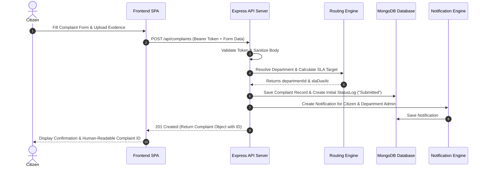
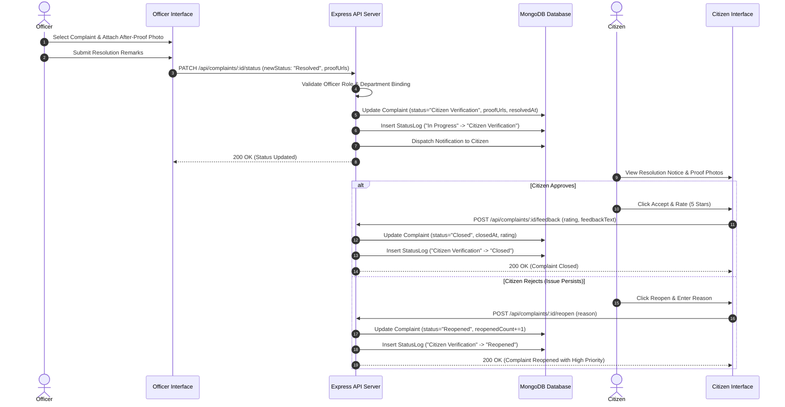
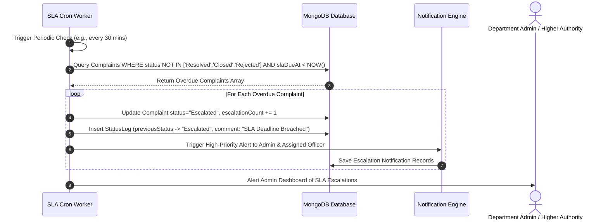

# High-Level Design (HLD)

## Complaint to Action — Civic Grievance & Resolution Platform

---

### 1. Architectural Overview

**Complaint to Action** is designed as a decoupled, multi-tiered client-server web application. It follows a clean architecture pattern separating the presentation layer (Single Page Application), API gateway/business logic layer (Node.js & Express), background job worker layer (SLA Escalation Engine), and data persistence layer (MongoDB / Firestore).

```mermaid
flowchart TD
    subgraph Client Layer [Presentation Layer - Single Page Application]
        UI[React 18 / Vite / Tailwind CSS]
        CitizenUI[Citizen Portal]
        OfficerUI[Officer Dashboard]
        AdminUI[Admin Control Panel]
        OperatorUI[Helpdesk Panel]
        UI --> CitizenUI & OfficerUI & AdminUI & OperatorUI
    end

    subgraph Gateway [API Gateway & Middleware Layer]
        Express[Express.js App]
        AuthMW[JWT Auth Middleware]
        RbacMW[Role Validation Middleware]
        UploadMW[Multer File Ingestion]
        RateLimiter[Rate Limiter & Cors]
        
        Express --> RateLimiter --> AuthMW --> RbacMW
    end

    subgraph ServiceLayer [Business Logic & Service Layer]
        AuthService[Auth Service]
        ComplaintService[Complaint Engine & State Machine]
        RoutingService[Department Routing Service]
        SLAService[SLA & Escalation Cron Worker]
        NotificationService[Notification Engine]
        ReportService[Analytics & Reports Service]
    end

    subgraph DataLayer [Persistence & Storage Layer]
        MongoDB[(MongoDB / Mongoose ODM)]
        Uploads[Local Uploads / Cloud File Storage]
    end

    Client Layer -->|HTTP / REST JSON| Gateway
    Gateway --> ServiceLayer
    ServiceLayer --> DataLayer
    SLAService -->|Scheduled Polling| ComplaintService
    ComplaintService -->|Trigger Alert| NotificationService
```

---

### 2. Core Architectural Subsystems

#### 2.1. Frontend Presentation Subsystem
- **Technology Stack**: React 18, Vite, React Router DOM, Tailwind CSS / Custom CSS Design Tokens, Recharts, Axios.
- **Role Partitioning**:
  - **Citizen Interface**: Form inputs, geolocation capture, interactive timelines, before/after media viewer, rating modals.
  - **Officer Interface**: Kanban/table view of assigned grievances, field note loggers, proof upload widget, SLA deadline timers.
  - **Admin Interface**: User provisioning, department management, SLA configuration, multi-metric dashboard charts, audit trail browser.
  - **Operator Interface**: Call-center assisted registration and phone-based status updating.

#### 2.2. API Gateway & Middleware Subsystem
- **Technology Stack**: Node.js (v18+), Express.js, Cors, Helmet, Multer.
- **Responsibilities**:
  - Route HTTP requests to designated domain controllers.
  - Stateless authentication verification via JWT headers (`Authorization: Bearer <token>`).
  - Role-Based Access Control (RBAC) enforcing permissions per endpoint.
  - Request body parsing and static file upload handling (`/uploads`).

#### 2.3. Domain Business Services

##### A. Auth & User Management Service
Handles registration, login, password hashing via `bcrypt`, JWT issuance, profile updates, and role-department associations.

##### B. Complaint Engine & State Machine
Enforces valid state transitions across the 10 lifecycle states (`Submitted`, `Under Review`, `Assigned`, `In Progress`, `Resolved`, `Citizen Verification`, `Closed`, `Reopened`, `Escalated`, `Rejected`). Logs every transition into the `StatusLog` collection.

##### C. Department Routing Engine
Evaluates new complaints against departmental mapping rules (matching `category` + `zoneCoverage`). Automatically binds matching `departmentId` and assigns initial SLA target date.

##### D. SLA & Escalation Background Worker
Executes on periodic cron intervals (e.g., every 15–60 minutes). Scans active complaints where `status` $\notin$ `['Resolved', 'Closed', 'Rejected']` and `currentTime > slaDueAt`. Automatically transitions status to `Escalated`, increments `escalationCount`, and dispatches escalation alerts.

##### E. Audit & Notification Service
Generates targeted notifications for affected users (citizens, assigned officers, department admins) and logs immutable historical state records.

##### F. Analytics & Governance Service
Aggregates performance metrics: SLA compliance percentages, average resolution times, category distributions, zone hotspots, and officer productivity scores.

---

### 3. Key Data Flow Diagrams

#### 3.1. Complaint Ingestion & Automated Department Routing Flow



#### 3.2. Resolution Submission & Proof Verification Cycle



#### 3.3. Background SLA Breach & Multi-Level Escalation Flow



---

### 4. Security Architecture & Access Control Matrix

#### 4.1. Authentication Architecture
- Stateless **JWT (JSON Web Tokens)** containing payload: `{ id, role, departmentId, email }`.
- Signed with server-side `JWT_SECRET` (HS256 algorithm).
- Expiration set via environment configuration (default 7 days).

#### 4.2. Role-Based Access Control (RBAC) Matrix

| Resource / Endpoint | Citizen | Officer | Admin | Operator |
|---|:---:|:---:|:---:|:---:|
| `POST /api/auth/register` | Public | Public | Public | Public |
| `POST /api/auth/login` | Public | Public | Public | Public |
| `POST /api/complaints` | ✅ (Own) | ❌ | ✅ | ✅ (On behalf) |
| `GET /api/complaints` | ✅ (Own) | ✅ (Dept/Zone) | ✅ (All) | ✅ (All) |
| `GET /api/complaints/:id` | ✅ (Own) | ✅ (Dept/Zone) | ✅ (All) | ✅ (All) |
| `PATCH /api/complaints/:id/status` | ❌ | ✅ (Assigned) | ✅ | ❌ |
| `POST /api/complaints/:id/reopen` | ✅ (Own) | ❌ | ✅ | ✅ (On behalf) |
| `POST /api/complaints/:id/feedback` | ✅ (Own) | ❌ | ✅ | ❌ |
| `GET /api/reports/*` | ❌ | ❌ | ✅ | ❌ |
| `POST /api/departments` | ❌ | ❌ | ✅ | ❌ |
| `POST /api/users` | ❌ | ❌ | ✅ | ❌ |

---

### 5. Deployment & System Topology

```mermaid
deployment
    title Deployment & Infrastructure Architecture

    node ServerHost [Application Server - Ubuntu / Windows Host] {
        node NodeProcess [Node.js Runtime] {
            component ExpressApp [Express.js HTTP Server]
            component CronJob [Background Cron Scheduler]
        }
        folder LocalStorage [Disk Storage / uploads]
    }

    node ClientHost [Web CDN / Static Web Host] {
        component ReactBuild [Built React Single Page App]
    }

    database DBHost [Database Host] {
        database MongoDB [(MongoDB Cluster / Local Database)]
    }

    User Browser -->|HTTPS| ReactBuild
    ReactBuild -->|REST / JSON| ExpressApp
    ExpressApp -->|Mongoose Connection| DBHost
    ExpressApp -->|Save Proof Files| LocalStorage
```
