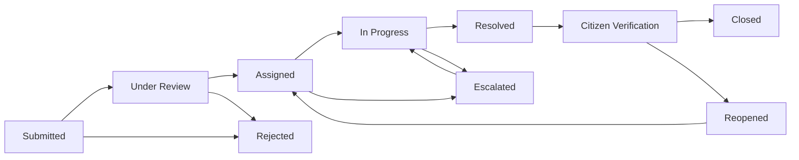

# Low-Level Design (LLD)

## Complaint to Action — Civic Grievance & Resolution Platform

---

### 1. Repository Directory Structure

```
complaint-to-action/
├── AGENT.md                      # Product Spec & Domain Guidelines
├── PRD.md                        # Product Requirements Document
├── HLD.md                        # High-Level Design Document
├── LLD.md                        # Low-Level Design Document
├── package.json                  # Root Workspace Configuration
├── client/                       # Frontend React SPA (Vite)
│   ├── index.html
│   ├── package.json
│   ├── vite.config.js
│   └── src/
│       ├── main.jsx              # Application Entry Point
│       ├── App.jsx               # Main Router, Layout & Views
│       ├── api.js                # Axios Client & API Helper Functions
│       ├── demoData.js           # Demo Seed Data Fallback
│       └── styles.css            # Design Tokens, Utility Classes & Glassmorphism
└── server/                       # Backend Express API Server
    ├── package.json
    ├── .env                      # Environment Variables Config
    ├── .env.example
    ├── uploads/                  # Local Storage Directory for Attached Media
    └── src/
        ├── index.js              # Express App Server Entry & DB Connection
        ├── seed.js               # CLI Seed Invocation Script
        ├── lib/
        │   └── seedMongo.js      # MongoDB Data Seeder Engine
        ├── middleware/
        │   └── auth.js           # JWT Verification & RBAC Authorization Middleware
        ├── models/
        │   ├── User.js           # User Mongoose Schema
        │   ├── Department.js     # Department Mongoose Schema
        │   ├── Complaint.js      # Complaint Mongoose Schema
        │   ├── StatusLog.js      # Status Transition Audit Log Schema
        │   └── Notification.js   # In-App Notification Schema
        └── routes/
            ├── auth.routes.js         # Authentication API Routes (/api/auth)
            ├── complaint.routes.js    # Complaint Lifecycle API Routes (/api/complaints)
            ├── department.routes.js   # Department Management API Routes (/api/departments)
            ├── user.routes.js         # User Management API Routes (/api/users)
            ├── report.routes.js       # Analytics & Governance API Routes (/api/reports)
            ├── notification.routes.js # Notification API Routes (/api/notifications)
            └── upload.routes.js       # File Upload API Routes (/api/upload)
```

---

### 2. Database Models & Mongoose Schemas

#### 2.1. User Schema (`server/src/models/User.js`)

```javascript
const userSchema = new mongoose.Schema(
  {
    _id: { type: String }, // Human-readable or UUID identifier
    name: { type: String, required: true, trim: true },
    email: { type: String, required: true, unique: true, lowercase: true, trim: true },
    mobile: { type: String, trim: true },
    address: { type: String, trim: true },
    passwordHash: { type: String, required: true },
    role: { 
      type: String, 
      enum: ["citizen", "officer", "admin", "operator"], 
      required: true 
    },
    departmentId: { type: String, default: null }, // Applicable for officers
    zoneIds: [{ type: String }],                   // Applicable for officers/departments
    isActive: { type: Boolean, default: true },
    emailVerified: { type: Boolean, default: true },
    emailOtpHash: { type: String, default: null },
    emailOtpExpiresAt: { type: Date, default: null },
    profileImage: { type: String, default: null }
  },
  { timestamps: true }
);
```

#### 2.2. Department Schema (`server/src/models/Department.js`)

```javascript
const departmentSchema = new mongoose.Schema(
  {
    _id: { type: String },
    name: { type: String, required: true, trim: true },
    description: { type: String },
    zoneCoverage: [{ type: String }],
    escalationLevel: { type: Number, default: 1 },
    active: { type: Boolean, default: true }
  },
  { timestamps: true }
);
```

#### 2.3. Complaint Schema (`server/src/models/Complaint.js`)

```javascript
const complaintSchema = new mongoose.Schema(
  {
    _id: { type: String },
    complaintId: { type: String, required: true, unique: true, index: true }, // e.g. CTA-2026-000101
    citizenId: { type: String, required: true, index: true },
    createdByRole: { 
      type: String, 
      enum: ["citizen", "officer", "admin", "operator"], 
      default: "citizen" 
    },
    title: { type: String, required: true, trim: true },
    description: { type: String, required: true },
    category: { type: String, required: true, index: true },
    subcategory: { type: String },
    severity: { 
      type: String, 
      enum: ["low", "medium", "high", "critical"], 
      default: "medium" 
    },
    status: {
      type: String,
      enum: [
        "Submitted", 
        "Under Review", 
        "Assigned", 
        "In Progress", 
        "Resolved", 
        "Citizen Verification", 
        "Closed", 
        "Reopened", 
        "Escalated", 
        "Rejected"
      ],
      default: "Submitted",
      index: true
    },
    departmentId: { type: String, index: true },
    assignedOfficerId: { type: String, index: true },
    locationText: { type: String, required: true },
    landmark: { type: String },
    geo: {
      lat: { type: Number },
      lng: { type: Number }
    },
    mediaUrls: [{ type: String }],   // Initial evidence files
    proofUrls: [{ type: String }],   // Resolution proof files
    slaDueAt: { type: Date, index: true },
    resolvedAt: { type: Date },
    closedAt: { type: Date },
    reopenedCount: { type: Number, default: 0 },
    escalationCount: { type: Number, default: 0 },
    isAnonymous: { type: Boolean, default: false },
    rating: { type: Number, min: 1, max: 5 },
    feedbackText: { type: String }
  },
  { timestamps: true }
);
```

#### 2.4. StatusLog Schema (`server/src/models/StatusLog.js`)

```javascript
const statusLogSchema = new mongoose.Schema(
  {
    complaintId: { type: String, required: true, index: true },
    previousStatus: { type: String },
    newStatus: { type: String, required: true },
    changedByUserId: { type: String, required: true },
    changedByRole: { type: String, required: true },
    comment: { type: String },
    attachments: [{ type: String }]
  },
  { timestamps: true }
);
```

#### 2.5. Notification Schema (`server/src/models/Notification.js`)

```javascript
const notificationSchema = new mongoose.Schema(
  {
    _id: { type: String },
    userId: { type: String, required: true, index: true },
    complaintId: { type: String },
    type: { type: String, required: true },
    title: { type: String, required: true },
    message: { type: String, required: true },
    isRead: { type: Boolean, default: false }
  },
  { timestamps: true }
);
```

---

### 3. REST API Endpoint Specifications

#### 3.1. Authentication Routes (`/api/auth`)

| Endpoint | Method | Middleware | Request Body | Description |
|---|---|---|---|---|
| `/register` | `POST` | None | `{ name, email, password, role, mobile, departmentId }` | Register new user account |
| `/login` | `POST` | None | `{ email, password }` | Authenticate user & return JWT token |
| `/me` | `GET` | `requireAuth` | None | Fetch authenticated user profile |
| `/forgot-password` | `POST` | None | `{ email }` | Initiate password reset OTP flow |

#### 3.2. Complaint Routes (`/api/complaints`)

| Endpoint | Method | Middleware | Request Body | Description |
|---|---|---|---|---|
| `/` | `GET` | `requireAuth` | Query: `status, category, departmentId, search` | List complaints (Filtered by role) |
| `/:id` | `GET` | `requireAuth` | None | Get detailed complaint object with timeline |
| `/` | `POST` | `requireAuth` | `{ title, description, category, subcategory, severity, locationText, landmark, geo, mediaUrls, isAnonymous }` | Submit new complaint |
| `/:id/status` | `PATCH` | `requireAuth` | `{ newStatus, comment, assignedOfficerId, proofUrls }` | Update complaint status & assign |
| `/:id/reopen` | `POST` | `requireAuth` | `{ reason }` | Reopen complaint (Citizen) |
| `/:id/feedback` | `POST` | `requireAuth` | `{ rating, feedbackText }` | Submit resolution satisfaction rating |

#### 3.3. Department & User Admin Routes (`/api/departments`, `/api/users`)

| Endpoint | Method | Middleware | Request Body | Description |
|---|---|---|---|---|
| `/api/departments` | `GET` | `requireAuth` | None | List all departments |
| `/api/departments` | `POST` | `requireAuth, requireAdmin` | `{ name, description, zoneCoverage }` | Create new department |
| `/api/users` | `GET` | `requireAuth, requireAdmin` | Query: `role, departmentId` | List users |
| `/api/users/:id` | `PATCH` | `requireAuth, requireAdmin` | `{ role, departmentId, isActive }` | Update user settings |

#### 3.4. Analytics & Governance Reports (`/api/reports`)

| Endpoint | Method | Middleware | Description |
|---|---|---|---|
| `/overview` | `GET` | `requireAuth, requireAdmin` | KPI summary counts (Total, Resolved, SLA breach %, Reopen %) |
| `/department` | `GET` | `requireAuth, requireAdmin` | Performance metrics grouped by Department |
| `/officers` | `GET` | `requireAuth, requireAdmin` | Resolution metrics per Officer |

---

### 4. Lifecycle State Transition Matrix



| Current Status | Target Status | Permitted Roles | Required Payload | Side-Effects |
|---|---|---|---|---|
| `Submitted` | `Under Review` | Admin | Optional comment | Log created |
| `Submitted` / `Under Review` | `Assigned` | Admin | `departmentId`, `assignedOfficerId` | Notify assigned officer |
| `Assigned` | `In Progress` | Officer, Admin | Progress comment | Log status update |
| `In Progress` | `Resolved` | Officer, Admin | `proofUrls` (min 1 photo), resolution comment | Set `resolvedAt`, status $\rightarrow$ `Citizen Verification`, notify citizen |
| `Citizen Verification` | `Closed` | Citizen, Admin, Auto-Cron | `rating` (1-5), `feedbackText` | Set `closedAt`, finalize grievance |
| `Citizen Verification` | `Reopened` | Citizen, Admin | `reason` (mandatory) | Increment `reopenedCount`, elevate priority, re-notify officer/admin |
| `In Progress` / `Assigned` | `Escalated` | Cron Worker, Admin | Overdue SLA breach trigger | Increment `escalationCount`, notify department head |
| *Any Active* | `Rejected` | Admin | Rejection reason | Set status $\rightarrow$ `Rejected`, notify citizen |

---

### 5. SLA & Escalation Engine Algorithm

```javascript
/**
 * SLA Escalation Cron Worker Logic
 * Runs periodically (e.g. every 15 mins)
 */
export async function checkSLAandEscalate() {
  const now = new Date();
  
  // Query active unresolved complaints exceeding SLA deadline
  const overdueComplaints = await Complaint.find({
    status: { $nin: ["Resolved", "Citizen Verification", "Closed", "Rejected"] },
    slaDueAt: { $lt: now }
  });

  for (const complaint of overdueComplaints) {
    const previousStatus = complaint.status;
    
    // Update complaint state
    complaint.status = "Escalated";
    complaint.escalationCount += 1;
    await complaint.save();

    // Create Audit Log
    await StatusLog.create({
      complaintId: complaint.complaintId,
      previousStatus: previousStatus,
      newStatus: "Escalated",
      changedByUserId: "SYSTEM_CRON",
      changedByRole: "admin",
      comment: `Automated SLA Breach Triggered. Exceeded deadline set for ${complaint.slaDueAt.toISOString()}`
    });

    // Send High-Priority Escalation Notification
    await Notification.create({
      _id: `notif_${Date.now()}_${Math.random().toString(36).substr(2, 5)}`,
      userId: complaint.assignedOfficerId || "ADMIN_DEPT_" + complaint.departmentId,
      complaintId: complaint.complaintId,
      type: "SLA_ESCALATION",
      title: `🚨 Escalation Alert: ${complaint.complaintId}`,
      message: `Complaint "${complaint.title}" has breached SLA deadline and requires immediate action.`
    });
  }
}
```

---

### 6. Error Handling & Standardized HTTP Responses

All API errors return a consistent JSON response envelope:

```json
{
  "error": {
    "code": "UNAUTHORIZED_ACCESS",
    "message": "You do not have permission to modify this complaint.",
    "status": 403,
    "timestamp": "2026-08-22T09:35:00.000Z"
  }
}
```

#### Standard HTTP Codes:
- `200 OK`: Request succeeded.
- `201 Created`: Resource successfully created.
- `400 Bad Request`: Validation failure or missing required fields.
- `401 Unauthorized`: Missing or expired JWT token.
- `403 Forbidden`: Authenticated user lacks required role permissions.
- `404 Not Found`: Complaint, User, or Department record does not exist.
- `500 Internal Server Error`: Uncaught database or server exception.
