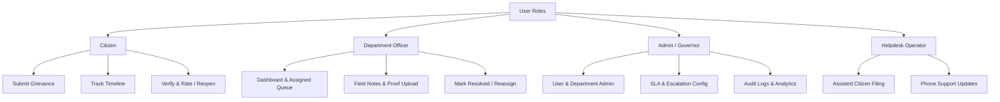
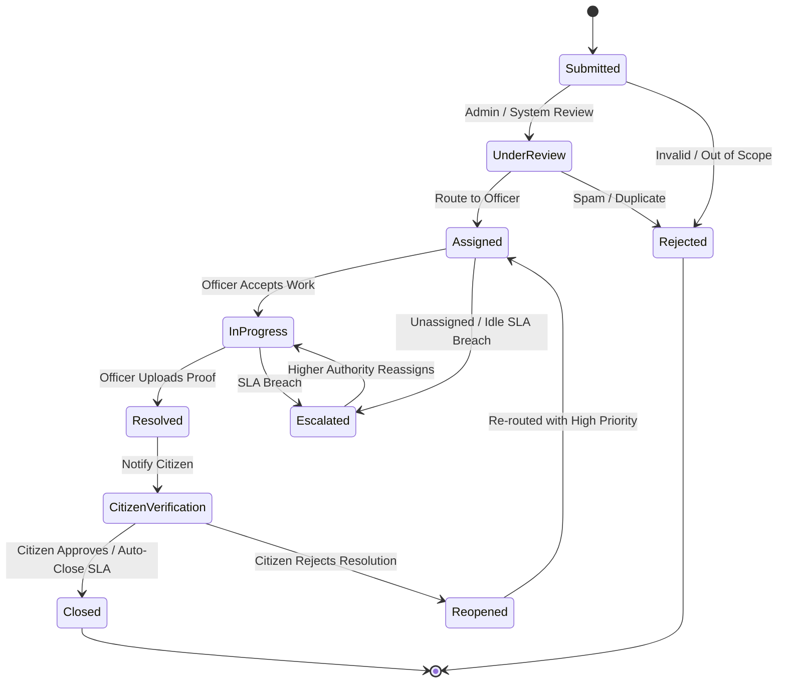

# Product Requirements Document (PRD)

## Complaint to Action — Civic Grievance & Resolution Platform

---

### 1. Document Overview

| Document Version | Status | Author / Owner | Target System |
|---|---|---|---|
| **v1.0.0** | Approved | Product & Engineering Team | Complaint to Action (MERN Stack) |

---

### 2. Product Vision & Executive Summary

**Complaint to Action** is a role-based civic grievance and resolution management system engineered to convert citizen complaints into time-bound, accountable, and proof-verifiable operational workflows. 

Traditional grievance platforms suffer from passive submission, opaque handling, manual routing delays, unverified closures, and lack of actionable performance analytics. **Complaint to Action** resolves these friction points by implementing:
- **Automated Routing**: Immediate departmental routing based on complaint category, subcategory, and geographic zone.
- **Dynamic SLA Enforcement**: Time-bound resolution deadlines enforced through automated background cron monitors.
- **Proof-Backed Resolution**: Requirement of before-and-after proof attachments (photos/documents) before a complaint can be marked as resolved.
- **Citizen Verification Loop**: Capability for citizens to accept resolutions or reopen unsatisfied complaints with mandatory escalation triggers.
- **Full Audit Trail**: Immutable logging of every status transition, assignment change, and officer remark.
- **Governance Analytics**: Real-time dashboards tracking area hotspots, SLA compliance, reopen rates, and officer metrics.

---

### 3. User Roles & Persona Hierarchy

The system defines 4 distinct user personas with strictly partitioned permissions:

#### 3.1. Citizen
- **Purpose**: File complaints, attach proof, monitor status in real-time, verify work quality, rate resolution satisfaction, or reopen unresolved issues.
- **Permissions**: View/edit own profile, create complaints (identified or anonymous), view own submitted complaints, append comments, reopen complaints, submit ratings/feedback.

#### 3.2. Department Officer
- **Purpose**: Manage assigned complaints within their department/zone, conduct field verification, update status, upload before/after media proof, and complete resolution.
- **Permissions**: View complaints assigned to their department/zone, accept/transfer complaints, update progress notes, upload resolution proof, mark as resolved.

#### 3.3. Admin / System Governor
- **Purpose**: Overall system administration, user provisioning, department setup, SLA configuration, escalation rule definitions, and high-level analytics monitoring.
- **Permissions**: Full read/write access across all system entities, audit logs, configuration matrices, and report generation.

#### 3.4. Helpdesk Operator (Optional / Assisted Role)
- **Purpose**: Assist citizens who contact support via phone or physical helpdesk by registering complaints on their behalf and tracking status.
- **Permissions**: Search citizen records by phone/ID, register complaints on behalf of citizens, add citizen comments over support calls.

---

### 4. Functional Requirements

#### FR-1: Authentication & User Governance
- **FR-1.1**: Support user registration and login using email/password, with optional OTP verification.
- **FR-1.2**: Issue JWT (JSON Web Tokens) with embedded role credentials (`citizen`, `officer`, `admin`, `operator`) for stateless session validation.
- **FR-1.3**: Admin control panel for activating, deactivating, or updating user roles and department bindings.
- **FR-1.4**: Support optional anonymous complaint submission for sensitive safety or integrity reports.

#### FR-2: Complaint Lifecycle & State Machine
The system MUST enforce a strict 10-state lifecycle workflow for every complaint:

#### FR-3: Complaint Creation & Media Ingestion
- **FR-3.1**: Citizen form requiring Title, Description, Category, Subcategory, Severity (`low`, `medium`, `high`, `critical`), Location Address, Landmark, and optional GPS Coordinates (`lat`, `lng`).
- **FR-3.2**: Support multi-file upload for initial evidence (JPEG, PNG, WEBP, PDF, MP4 up to 10MB per file).
- **FR-3.3**: Automatic generation of human-readable Complaint IDs in format `CTA-YYYY-XXXXXX` (e.g., `CTA-2026-000142`).

#### FR-4: Automated Routing & SLA Calculation
- **FR-4.1**: Auto-route new complaints to the responsible Department based on `Category` + `Subcategory` + `Zone/Ward`.
- **FR-4.2**: Calculate `slaDueAt` timestamp upon submission according to configured SLA matrices.
  - *Default SLA Benchmarks*:
    - Water Leakage / Pipe Burst: 12 Hours
    - Garbage Dumping / Sanitation: 24 Hours
    - Streetlight Failure: 48 Hours
    - Road Damage / Potholes: 72 Hours
    - General Complaints: 120 Hours
- **FR-4.3**: Escalation Engine periodically evaluates active complaints. If current time exceeds `slaDueAt` and status is not `Resolved` or `Closed`, trigger automated escalation to higher department authority, increment `escalationCount`, and dispatch SLA breach alerts.

#### FR-5: Verification & Proof-Backed Resolution
- **FR-5.1**: Officer MUST upload at least one image/video/document proof (`proofUrls`) and enter mandatory completion remarks before marking a complaint as `Resolved`.
- **FR-5.2**: Upon resolution, complaint moves to `Citizen Verification`. Citizen is notified to review resolution details and before/after proof.
- **FR-5.3**: Citizen can either:
  - **Approve**: Complaint transitions to `Closed`, prompt citizen for 1–5 star rating and textual feedback.
  - **Reject / Reopen**: Complaint transitions to `Reopened`, requires mandatory reopening reason, increments `reopenedCount`, and elevates priority for re-handling.
- **FR-5.4**: Auto-Closure Rule: If citizen does not respond within 7 days of resolution, system automatically transitions status from `Citizen Verification` to `Closed`.

#### FR-6: Timeline Audit Log & Notifications
- **FR-6.1**: Maintain an immutable `StatusLog` entry for every status change, capturing `previousStatus`, `newStatus`, `changedByUserId`, `changedByRole`, timestamp, comments, and attachments.
- **FR-6.2**: In-App Notification System generating alerts for:
  - Complaint Submission Confirmation
  - Officer Assignment
  - Status Updates (In Progress, Resolved)
  - SLA Breach & Escalation Alerts
  - Reopen Requests

#### FR-7: Governance & Analytics Reporting
- **FR-7.1**: Real-time KPI summary widgets (Total Complaints, Pending, In Progress, Resolved, Escalated, Reopened Rate).
- **FR-7.2**: Department Performance breakdown (Avg Resolution Time, SLA Compliance %, Reopen Rate %).
- **FR-7.3**: Issue Category breakdown & Geographic Hotspot Distribution.
- **FR-7.4**: Report export capability (CSV/PDF) for official audits.

---

### 5. Non-Functional Requirements (NFRs)

#### 5.1. Performance & Responsiveness
- API P95 Response Time < 200ms for read operations and < 500ms for complaint submission/updates.
- Frontend Single Page Application (SPA) first contentful paint < 1.5 seconds.

#### 5.2. Security & Compliance
- Passwords hashed using `bcrypt` (salt factor >= 10).
- All API endpoints protected via JWT middleware checking explicit user roles (`citizen`, `officer`, `admin`, `operator`).
- Strict payload sanitization to mitigate XSS and NoSQL Injection vulnerabilities.
- File upload validation validating MIME types and file signatures.

#### 5.3. Reliability & Availability
- Database persistence using MongoDB / Firestore with transaction support for status transitions and audit log writes.
- Graceful error handling returning standardized JSON error schemas.

#### 5.4. Maintainability & Code Quality
- Modular architecture cleanly separating Models, Controllers/Routes, Middleware, and Services.
- Configurable environment settings (`.env`) for DB URIs, JWT secrets, storage directories, and port bindings.

---

### 6. Future Scope & Enhancements

- **AI-Based Categorization**: Automated image and text analysis to suggest category and severity upon upload.
- **Duplicate Detection**: Geographic proximity matching ($\le 50\text{m}$) to group duplicate complaints for the same incident.
- **Multi-Channel Intake**: Integration with WhatsApp Bot and Voice Interactive Response (IVR).
- **GIS Map Hotspots**: Visual heatmap clustering on interactive maps (Leaflet/Mapbox).
